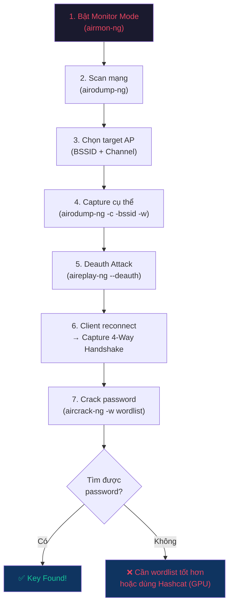

# 📚 Tổng hợp Kiến thức & Khái niệm từ Báo cáo InfoSec

> [!NOTE]
> Báo cáo: "Exploring and Deploying Aircrack-ng and Wifite in Kali Linux"
> Môn: Information System Security — VKU, Da Nang, May 2026

---

## 📑 Mục lục

### Phần 1 — Kiến thức & Khái niệm
- [A. Chuẩn mã hóa Wi-Fi](#-a-chuẩn-mã-hóa-wi-fi-wireless-encryption-standards)
- [B. 4-Way Handshake (WPA/WPA2)](#-b-4-way-handshake-wpawpa2)
- [C. Các loại tấn công Wireless](#-c-các-loại-tấn-công-wireless)
- [D. Bộ công cụ Aircrack-ng](#️-d-bộ-công-cụ-aircrack-ng)
- [E. Wifite](#-e-wifite)
- [Tổng hợp: 2 Tool & Utility con](#-tổng-hợp-2-tool--các-utility-con-sử-dụng-trong-đề-tài)
- [F. Môi trường & Hạ tầng](#️-f-môi-trường--hạ-tầng)
- [G. Phòng thủ & Khuyến nghị](#️-g-phòng-thủ--khuyến-nghị)

### Phần 2 — Tại sao dùng "A" mà không dùng "B, C, D"?
- [Kali Linux vs Ubuntu/Windows/Parrot OS](#-tại-sao-dùng-kali-linux-mà-không-dùng-ubuntuwindowsparrot-os)
- [Aircrack-ng vs Hashcat/Kismet/Fern](#-tại-sao-dùng-aircrack-ng-mà-không-dùng-hashcatkismetfern-wifi-cracker)
- [Wifite vs Fluxion/WiFiPhisher/Bettercap](#-tại-sao-dùng-wifite-mà-không-dùng-fluxionwifiphisherbettercap)
- [WPA2-PSK vs WEP/WPA3](#-tại-sao-dùng-wpa2-psk-làm-mục-tiêu-test-mà-không-dùng-wepwpa3)
- [Dictionary Attack vs Brute-force/Rainbow Table](#-tại-sao-dùng-dictionary-attack-wordlist-mà-không-dùng-pure-brute-force-hoặc-rainbow-table)

### Phần 3 — Sơ đồ & Checklist
- [3. Sơ đồ Tổng quan Quy trình Tấn công](#3-sơ-đồ-tổng-quan-quy-trình-tấn-công)
- [4. Checklist Kiến thức Bảo vệ Báo cáo](#4-checklist-kiến-thức-để-chuẩn-bị-bảo-vệ-báo-cáo)

### Phần 5 — Luồng thực hiện & Lệnh
- [A. Aircrack-ng — Quy trình thủ công (5 bước)](#-a-aircrack-ng--quy-trình-thủ-công-5-bước)
- [B. Wifite — Quy trình tự động (1 lệnh)](#-b-wifite--quy-trình-tự-động-1-lệnh)
- [C. So sánh nhanh: Khi nào dùng tool nào?](#-c-so-sánh-nhanh-khi-nào-dùng-tool-nào)

### Phần 6 — Bảng Từ vựng Chuyên ngành
- [🔐 Mã hóa & Giao thức](#-mã-hóa--giao-thức)
- [🤝 Xác thực & Handshake](#-xác-thực--handshake)
- [📡 Mạng & Wireless](#-mạng--wireless)
- [⚔️ Tấn công & Khai thác](#️-tấn-công--khai-thác)
- [🛠️ Công cụ & Kỹ thuật](#️-công-cụ--kỹ-thuật)
- [🛡️ Phòng thủ & Bảo mật](#️-phòng-thủ--bảo-mật)
- [📄 Thuật ngữ học thuật](#-thuật-ngữ-học-thuật)

---

## 1. Danh sách Kiến thức & Khái niệm Cần Nắm

### 🔐 A. Chuẩn mã hóa Wi-Fi (Wireless Encryption Standards)

| Chuẩn | Năm | Mã hóa | Mức độ an toàn | Cần biết |
|-------|-----|--------|----------------|----------|
| **WEP** | 1997 | RC4 (stream cipher), IV 24-bit | Rất yếu — dễ crack | IV reuse, static key → Aircrack-ng crack trong vài phút |
| **WPA** | 2003 | RC4 + TKIP | Trung bình | TKIP thay đổi key mỗi packet, nhưng vẫn dùng RC4 |
| **WPA2** | 2004 | **AES + CCMP** | Mạnh | Chuẩn phổ biến nhất hiện tại. Lỗ hổng KRACK (2017) |
| **WPA3** | 2018 | AES + GCMP, **SAE** | Rất mạnh | Forward secrecy, chống brute-force offline |

**Mở rộng cần nắm:**
- **RC4**: Stream cipher — mã hóa từng byte, nhanh nhưng yếu vì IV ngắn (24-bit → ~16 triệu khả năng → dễ trùng lặp)
- **AES (Advanced Encryption Standard)**: Block cipher 128/192/256-bit, chuẩn vàng hiện tại
- **TKIP vs CCMP**: TKIP là bản vá tạm cho RC4; CCMP dùng AES, mạnh hơn hẳn
- **SAE (Simultaneous Authentication of Equals)**: Thay thế PSK handshake, chống offline dictionary attack
- **Forward Secrecy**: Dù lộ key hiện tại, dữ liệu quá khứ vẫn an toàn
- **KRACK Attack**: Khai thác lỗi reinstallation key trong 4-way handshake WPA2

---

### 🤝 B. 4-Way Handshake (WPA/WPA2)

Quy trình xác thực 4 bước giữa client và AP:

```
Client                         Access Point
  |---- 1. ANonce ------------->|
  |<--- 2. SNonce + MIC --------|
  |---- 3. Install Key + MIC -->|
  |<--- 4. ACK -----------------|
```

**Cần nắm:**
- **ANonce / SNonce**: Số ngẫu nhiên (nonce) để tạo PTK (Pairwise Transient Key)
- **MIC (Message Integrity Code)**: Đảm bảo message không bị sửa đổi
- **PTK**: Key phiên dùng để mã hóa traffic giữa client & AP
- **PMK (Pairwise Master Key)**: Được tạo từ PSK + SSID → dùng để sinh PTK
- Capture handshake = có đủ thông tin để thử brute-force PSK offline

---

### 📡 C. Các loại tấn công Wireless

| Tấn công | Mô tả | Công cụ |
|----------|-------|---------|
| **Deauthentication** | Gửi fake deauth frame → đá client ra → bắt handshake khi reconnect | aireplay-ng, mdk4 |
| **Handshake Capture** | Bắt 4-way handshake để crack offline | airodump-ng, Wifite |
| **Brute-force / Dictionary** | Thử từng password từ wordlist | aircrack-ng, hashcat, John the Ripper |
| **Evil Twin / Rogue AP** | Tạo AP giả cùng SSID → MitM | hostapd, Fluxion |
| **Packet Sniffing** | Bắt traffic trên mạng mở/yếu | Wireshark, tcpdump |
| **WPS Attack** | Brute-force WPS PIN (8 chữ số, ~11000 khả năng) | Reaver, Bully |
| **MAC Spoofing** | Giả MAC để bypass MAC filtering | macchanger |

**Mở rộng:**
- **802.11 Management Frames**: Không mã hóa trong WPA2 → deauth attack khai thác điều này. WPA3 có **Protected Management Frames (PMF)** để khắc phục
- **PMKID Attack**: Không cần deauth, chỉ cần 1 frame từ AP → nhanh hơn handshake capture (phát hiện 2018)

---

### 🛠️ D. Bộ công cụ Aircrack-ng

| Tool | Chức năng |
|------|-----------|
| **airmon-ng** | Bật/tắt monitor mode trên wireless interface |
| **airodump-ng** | Scan mạng, hiển thị AP + client, capture handshake |
| **aireplay-ng** | Inject packet, deauth attack |
| **aircrack-ng** | Crack WPA/WPA2 key từ .cap file + wordlist |

**Mở rộng:**
- **airbase-ng**: Tạo fake AP (Evil Twin)
- **airdecap-ng**: Giải mã traffic đã capture khi có key
- **packetforge-ng**: Tạo encrypted packet cho injection
- **airtun-ng**: Tạo virtual tunnel interface

---

### 🤖 E. Wifite

- Automated tool chạy trên nền Aircrack-ng, Reaver, Bully
- Tự động: scan → chọn target → deauth → capture handshake → crack
- Lưu handshake (.cap) và kết quả (cracked.json)

---

### 🔧 Tổng hợp: 2 Tool & các Utility con sử dụng trong đề tài

Đề tài sử dụng **2 tool chính**: Aircrack-ng (suite) và Wifite (automated wrapper).

#### Suite 1: **Aircrack-ng** — 4 utility được sử dụng

| # | Utility | Vai trò | Lệnh trong báo cáo |
|---|---------|---------|---------------------|
| 1 | **airmon-ng** | Bật **monitor mode** trên USB Wi-Fi card | `airmon-ng start wlan0` |
| 2 | **airodump-ng** | **Scan** mạng Wi-Fi + **capture handshake** (.cap) | `airodump-ng wlan0mon` → `airodump-ng -c [ch] --bssid [BSSID] -w [file] [card]` |
| 3 | **aireplay-ng** | **Deauth attack** — đá client ra để bắt handshake khi reconnect | `aireplay-ng --deauth 20 -a [BSSID] -c [MAC] [card]` |
| 4 | **aircrack-ng** | **Crack password** từ file .cap bằng wordlist | `aircrack-ng -w wordlist.txt -b [BSSID] capture.cap` |

**Quy trình thủ công**: `airmon-ng` → `airodump-ng` → `aireplay-ng` → `aircrack-ng`

#### Suite 2: **Wifite** — gọi 3 utility bên dưới

Wifite là **1 script Python duy nhất**, tự động gọi các tool khác tùy tình huống:

| Utility bên dưới | Vai trò trong Wifite |
|---|---|
| **aircrack-ng** (suite) | Scan, capture handshake, crack password |
| **Reaver** | Brute-force WPS PIN |
| **Bully** | Brute-force WPS PIN (thay thế Reaver) |

**Quy trình tự động**: Chỉ 1 lệnh `sudo wifite --dict mkwifi.txt` → tự động scan → deauth → capture → crack.

#### So sánh workflow trong báo cáo

| | Aircrack-ng (manual) | Wifite (automated) |
|--|---|---|
| **Số lệnh cần gõ** | 4+ lệnh riêng biệt | 1 lệnh duy nhất |
| **Cơ chế bên trong** | Chính nó (là suite gốc) | Gọi Aircrack-ng + Reaver + Bully |
| **Kết quả thực nghiệm** | Crack `12345678`, tốc độ **1769 keys/s** | Crack password, tốc độ **~1673.8 kps** |
| **Wordlist sử dụng** | mkwifi.txt | mkwifi.txt (qua `--dict`) |
| **Ưu điểm** | Kiểm soát từng bước, output chi tiết (Master Key, PTK, EAPOL HMAC) | Nhanh, đơn giản, phù hợp quick audit |
| **Nhược điểm** | Cần kiến thức sâu, nhiều bước | Ít tùy chỉnh, có thể bỏ sót lỗ hổng tinh vi |

> **Tổng cộng**: Đề tài sử dụng **4 utility của Aircrack-ng** (trực tiếp) + **Reaver & Bully** (gián tiếp qua Wifite).

---

### 🖥️ F. Môi trường & Hạ tầng

| Khái niệm | Mô tả |
|------------|-------|
| **Kali Linux** | Distro Linux chuyên pentest, cài sẵn 600+ tool bảo mật |
| **Monitor Mode** | Chế độ NIC bắt mọi packet trong không khí (không chỉ packet gửi cho mình) |
| **Packet Injection** | Khả năng gửi packet tùy ý vào mạng wireless |
| **VirtualBox** | Ảo hóa; cần passthrough USB Wi-Fi adapter |
| **USB Wi-Fi Adapter** | Phải hỗ trợ monitor mode + injection (chipset Atheros, Ralink, Realtek RTL8812AU...) |

---

### 🛡️ G. Phòng thủ & Khuyến nghị

- Dùng **WPA3** hoặc WPA2-AES (không dùng WEP/WPA)
- Mật khẩu **>12 ký tự**, phức tạp, không dùng từ phổ biến
- **Tắt WPS**
- **MAC filtering** (thêm một lớp, không phải giải pháp chính)
- **Network segmentation** (tách guest / internal)
- **IDS/IPS**: Suricata, Snort
- **Cập nhật firmware** router thường xuyên
- **Pentesting định kỳ**

---

## 2. Tại sao dùng "A" mà không dùng "B, C, D"?

### 🔹 Tại sao dùng **Kali Linux** mà không dùng Ubuntu/Windows/Parrot OS?

| So sánh | Kali Linux ✅ | Ubuntu ❌ | Windows ❌ | Parrot OS 🔄 |
|---------|-------------|----------|-----------|-------------|
| Tool pentest cài sẵn | 600+ tool | Phải cài thủ công | Hầu hết không hỗ trợ | Có, nhưng ít phổ biến hơn |
| Monitor mode | Hỗ trợ native | Phải config nhiều | Không hỗ trợ tốt | Hỗ trợ tốt |
| Packet injection | Có sẵn driver | Cần cài thêm | Rất hạn chế | Có |
| Tài liệu/cộng đồng | Rất lớn (chuẩn ngành) | Ít cho pentest | Không phù hợp | Nhỏ hơn Kali |
| Dùng trong giáo dục | Chuẩn trong các khóa CEH, OSCP | Không phổ biến | Không | Ít |

> **Kết luận**: Kali Linux là lựa chọn chuẩn ngành vì cài sẵn mọi thứ, driver tương thích, cộng đồng lớn, và được dùng trong các chứng chỉ bảo mật quốc tế.

---

### 🔹 Tại sao dùng **Aircrack-ng** mà không dùng Hashcat/Kismet/Fern WiFi Cracker?

| So sánh | Aircrack-ng ✅ | Hashcat | Kismet | Fern WiFi Cracker |
|---------|-------------|---------|--------|-------------------|
| Chức năng chính | **Toàn bộ pipeline**: monitor → scan → deauth → capture → crack | Chỉ crack (nhưng nhanh hơn nhờ GPU) | Chỉ scan/detect, không crack | GUI-based, hạn chế |
| Hỗ trợ GPU | Không (CPU only) | **Có (CUDA/OpenCL)** | Không | Không |
| Monitor mode | Có (airmon-ng) | Không | Có | Phụ thuộc aircrack |
| Deauth attack | Có (aireplay-ng) | Không | Không | Có |
| Độ phổ biến | **Chuẩn ngành** | Phổ biến cho password cracking | Phổ biến cho wireless recon | Ít dùng |
| Học thuật | Nhiều tài liệu | Ít tài liệu cho wireless | Chuyên recon | Ít |

> **Kết luận**: Aircrack-ng là bộ công cụ **đầy đủ nhất** cho wireless pentest (từ scan đến crack). Hashcat mạnh hơn ở khâu crack nhưng không có khả năng capture/deauth. Trong báo cáo học thuật, Aircrack-ng cho phép demo **toàn bộ quy trình** tấn công.

---

### 🔹 Tại sao dùng **Wifite** mà không dùng Fluxion/WiFiPhisher/Bettercap?

| So sánh | Wifite ✅ | Fluxion | WiFiPhisher | Bettercap |
|---------|---------|---------|-------------|-----------|
| Mục đích | Auto pentest WPA/WPA2 | Evil Twin + social engineering | Phishing Wi-Fi | MitM framework |
| Cách tiếp cận | **Technical** (brute-force) | Social engineering | Social engineering | Network attack |
| Tự động hóa | Cao | Trung bình | Trung bình | Thấp |
| Dùng Aircrack-ng | **Có** (nền tảng) | Có | Không | Không |
| Phù hợp học thuật | **Rất phù hợp** | Phức tạp, ethical issues | Social engineering focus | Quá rộng |
| Dễ demo | **Có** | Cần nhiều setup | Cần nhiều setup | Cần kinh nghiệm |

> **Kết luận**: Wifite bổ sung hoàn hảo cho Aircrack-ng vì nó **tự động hóa** đúng những gì Aircrack-ng làm thủ công. So sánh 2 tool này cho thấy rõ trade-off **manual vs automated**, rất phù hợp cho mục đích học thuật. Các tool khác (Fluxion, WiFiPhisher) tập trung vào social engineering — khác hướng nghiên cứu.

---

### 🔹 Tại sao dùng **WPA2-PSK** làm mục tiêu test mà không dùng WEP/WPA3?

| | WEP ❌ | WPA2-PSK ✅ | WPA3 ❌ |
|--|-------|------------|--------|
| Phổ biến | Gần như không còn | **Phổ biến nhất** hiện tại | Đang tăng dần |
| Độ khó crack | Quá dễ (vài phút) | Vừa phải (phụ thuộc password) | Rất khó (SAE chống offline attack) |
| Giá trị học thuật | Quá đơn giản | **Lý tưởng** — đủ phức tạp để học | Quá mới, ít tool hỗ trợ |
| Thực tế | Không còn ai dùng | **80%+ mạng hiện tại** | Cần hardware mới |

> **Kết luận**: WPA2-PSK là mục tiêu thực tế nhất vì đại diện cho phần lớn mạng Wi-Fi hiện tại, đủ phức tạp để demo kỹ thuật tấn công, và có công cụ hỗ trợ đầy đủ.

---

### 🔹 Tại sao dùng **Dictionary Attack** (wordlist) mà không dùng pure brute-force hoặc rainbow table?

| | Dictionary Attack ✅ | Pure Brute-force ❌ | Rainbow Table ❌ |
|--|---------------------|---------------------|-----------------|
| Tốc độ | Nhanh (chỉ thử từ trong list) | **Cực chậm** (thử mọi tổ hợp) | Nhanh (lookup) |
| Hiệu quả | Cao nếu password phổ biến | Đảm bảo tìm được, nhưng có thể mất **năm** | Không áp dụng cho WPA2 |
| Lý do không dùng | — | 8 ký tự lowercase = 208 tỷ tổ hợp | WPA2 dùng SSID làm salt → mỗi mạng cần table riêng → không khả thi |
| Phù hợp demo | **Có** (nhanh, rõ ràng) | Quá lâu | Không khả thi |

> **Kết luận**: Dictionary attack (dùng wordlist như `rockyou.txt`) là phương pháp thực tế nhất. WPA2 dùng SSID làm salt nên rainbow table không hiệu quả. Pure brute-force quá chậm cho demo.

---

## 3. Sơ đồ Tổng quan Quy trình Tấn công



---

## 4. Checklist Kiến thức để Chuẩn bị Bảo vệ Báo cáo

- [ ] Giải thích sự khác nhau giữa WEP → WPA → WPA2 → WPA3
- [ ] Mô tả 4-Way Handshake và tại sao capture nó quan trọng
- [ ] Giải thích Monitor Mode vs Managed Mode
- [ ] Liệt kê workflow Aircrack-ng (airmon → airodump → aireplay → aircrack)
- [ ] So sánh Aircrack-ng (manual) vs Wifite (automated)
- [ ] Giải thích Deauthentication Attack hoạt động thế nào
- [ ] Tại sao dùng dictionary attack thay vì brute-force / rainbow table
- [ ] Các biện pháp phòng thủ (WPA3, strong password, disable WPS, IDS...)
- [ ] Ethical hacking: tại sao phải có consent, legal implications
- [ ] Tại sao cần USB Wi-Fi adapter riêng (chipset hỗ trợ monitor mode)

---

## 5. Luồng thực hiện chi tiết & Giải thích lệnh

### 🔧 A. Aircrack-ng — Quy trình thủ công (5 bước)

#### Bước 0: Tắt các service gây xung đột

```bash
sudo systemctl stop NetworkManager
sudo systemctl stop wpa_supplicant
```

| Lệnh | Tại sao? |
|---|---|
| `stop NetworkManager` | Ngăn hệ thống tự quản lý Wi-Fi → gây conflict với monitor mode |
| `stop wpa_supplicant` | Ngăn service quản lý WPA connection → gây xung đột khi scan/inject |

---

#### Bước 1: Bật Monitor Mode

```bash
sudo airmon-ng start wlan0
```

| Tham số | Ý nghĩa |
|---|---|
| `start` | Bật monitor mode (dùng `stop` để tắt) |
| `wlan0` | Tên interface Wi-Fi (USB adapter). Sau khi bật sẽ đổi thành `wlan0mon` |

**Kết quả**: Interface `wlan0` → `wlan0mon` (monitor mode), có thể bắt **mọi packet** trong không khí.

> **Monitor Mode vs Managed Mode**: Managed mode chỉ nhận packet gửi cho mình. Monitor mode bắt **tất cả** packet → cần thiết để scan mạng người khác và capture handshake.

---

#### Bước 2: Scan mạng Wi-Fi

```bash
sudo airodump-ng wlan0mon
```

| Tham số | Ý nghĩa |
|---|---|
| `wlan0mon` | Interface đã ở monitor mode |

**Output hiển thị:**

| Cột | Ý nghĩa |
|---|---|
| **BSSID** | MAC address của Access Point (định danh duy nhất) |
| **PWR** | Cường độ tín hiệu (số càng gần 0 = càng mạnh) |
| **CH** | Channel mà AP đang phát |
| **ENC** | Loại mã hóa (WEP/WPA/WPA2) |
| **ESSID** | Tên mạng Wi-Fi (SSID) |
| **STATION** | MAC address của client đang kết nối |

> Bước này để **chọn mục tiêu**: ghi lại BSSID, Channel, và MAC client.

---

#### Bước 3: Capture cụ thể (focus vào 1 AP)

```bash
sudo airodump-ng -c 6 --bssid E2:9E:5E:E6:1E:44 -w capture wlan0mon
```

| Tham số | Ý nghĩa |
|---|---|
| `-c 6` | Chỉ lắng nghe **channel 6** (channel của AP mục tiêu) |
| `--bssid E2:9E:5E:E6:1E:44` | Chỉ capture traffic của AP có MAC này |
| `-w capture` | Lưu file output với prefix `capture` → tạo ra `capture-01.cap` |
| `wlan0mon` | Interface monitor |

**Kết quả**: File `.cap` chứa mọi packet từ AP đó. **Giữ terminal này mở** để chờ bắt handshake.

> Khi handshake bắt được, trên góc phải sẽ hiển thị: `WPA handshake: E2:9E:5E:E6:1E:44`

---

#### Bước 4: Deauthentication Attack (mở terminal mới)

```bash
sudo aireplay-ng --deauth 20 -a E2:9E:5E:E6:1E:44 -c AA:BB:CC:DD:EE:FF wlan0mon
```

| Tham số | Ý nghĩa |
|---|---|
| `--deauth 20` | Gửi **20 deauth frame** (số lượng có thể tùy chỉnh, `0` = liên tục) |
| `-a E2:9E:5E:E6:1E:44` | MAC của **Access Point** mục tiêu |
| `-c AA:BB:CC:DD:EE:FF` | MAC của **client** cụ thể bị đá ra (bỏ `-c` = deauth tất cả client) |
| `wlan0mon` | Interface monitor |

**Tại sao deauth?** Khi client bị đá ra → nó tự reconnect → AP và client thực hiện **4-way handshake** → airodump-ng (bước 3) bắt được handshake này.

> **Tùy chỉnh**: `--deauth 0` gửi liên tục (DoS), `--deauth 5` gửi ít hơn (đủ để force reconnect mà không gây nghi ngờ).

---

#### Bước 5: Crack password

```bash
sudo aircrack-ng -w mkwifi.txt -b E2:9E:5E:E6:1E:44 capture-01.cap
```

| Tham số | Ý nghĩa |
|---|---|
| `-w mkwifi.txt` | Đường dẫn **wordlist** (file chứa danh sách password thử) |
| `-b E2:9E:5E:E6:1E:44` | BSSID của AP mục tiêu (trong file .cap có thể có nhiều AP) |
| `capture-01.cap` | File capture chứa handshake |

**Kết quả thực nghiệm trong báo cáo:**
- Keys tested: 1354 / 418107
- Speed: **1769 keys/sec**
- **KEY FOUND! [ 12345678 ]**
- Hiển thị: Master Key, Transient Key, EAPOL HMAC → xác minh handshake hợp lệ

> **Tùy chỉnh wordlist**: Dùng `rockyou.txt` (~14 triệu password) hoặc tự tạo wordlist bằng `crunch`:
> ```bash
> crunch 8 8 0123456789 -o numbers8.txt   # Tạo mọi tổ hợp 8 chữ số
> ```

---

### 🤖 B. Wifite — Quy trình tự động (1 lệnh)

#### Cài đặt (nếu chưa có):

```bash
sudo apt update
sudo apt install wifite
```

#### Chạy:

```bash
sudo wifite --dict mkwifi.txt
```

| Tham số | Ý nghĩa |
|---|---|
| `--dict mkwifi.txt` | Chỉ định wordlist custom (mặc định Wifite dùng wordlist riêng) |

**Các tham số tùy chỉnh hữu ích khác:**

| Tham số | Ý nghĩa |
|---|---|
| `--kill` | Tự động tắt NetworkManager (thay vì tắt thủ công) |
| `--wpa` | Chỉ tấn công mạng WPA/WPA2 |
| `--wps` | Chỉ tấn công mạng có WPS bật |
| `--channel 6` | Chỉ scan channel 6 |
| `--num-deauths 5` | Số deauth packet gửi (mặc định: 1) |
| `--skip-crack` | Chỉ capture handshake, không crack (để crack sau bằng aircrack-ng/hashcat) |
| `-i wlan0mon` | Chỉ định interface |
| `--no-reaver` | Không dùng Reaver (bỏ qua WPS attack) |

#### Luồng tự động của Wifite:

```
1. Bật monitor mode (gọi airmon-ng)
       ↓
2. Scan tất cả mạng xung quanh
   → Hiển thị: ESSID, BSSID, CH, ENC, PWR, WPS status
       ↓
3. Người dùng chọn target (nhập số thứ tự hoặc `all`)
       ↓
4. Wifite tự gửi deauth → bắt handshake
   (gọi aireplay-ng + airodump-ng bên dưới)
       ↓
5. Nếu WPS bật → thử WPS PIN attack (gọi Reaver/Bully)
       ↓
6. Crack handshake bằng wordlist (gọi aircrack-ng)
       ↓
7. Kết quả:
   - Handshake → lưu file .cap
   - Password → lưu vào cracked.json
```

**Kết quả thực nghiệm trong báo cáo:**
- Target: `Test` (BSSID: E2:9E:5E:E6:1E:44)
- Handshake capture: ✅ thành công
- Wordlist: mkwifi.txt
- Speed: **~1673.8 kps**
- Password cracked → lưu `cracked.json`

---

### 📊 C. So sánh nhanh: Khi nào dùng tool nào?

| Tình huống | Nên dùng | Lý do |
|---|---|---|
| **Học / demo** quy trình tấn công | Aircrack-ng | Hiểu từng bước, thấy rõ cơ chế |
| **Quick audit** nhiều mạng | Wifite | Tự động, nhanh, scan nhiều target |
| **Cần output chi tiết** (Master Key, EAPOL...) | Aircrack-ng | Wifite chỉ hiện kết quả tối giản |
| **Cần crack nhanh hơn** (GPU) | Hashcat (kết hợp) | `aircrack-ng` / `wifite` capture → `hashcat` crack |
| **Tấn công WPS** | Wifite | Tự động gọi Reaver/Bully |
| **Tùy chỉnh deauth** (số packet, target cụ thể) | Aircrack-ng | `aireplay-ng` có nhiều option hơn |

---

## 6. Bảng Từ vựng Chuyên ngành (Glossary)

> 💡 Click vào từ viết tắt in đậm trong cột 3 & 4 để nhảy đến dòng định nghĩa tương ứng.

### 🔐 Mã hóa & Giao thức

| Từ vựng | IPA | Nghĩa cần nắm | Khái niệm liên quan trong nghĩa |
|---------|-----|----------------|------|
| <a id="t-encryption">Encryption</a> | /ɪnˈkrɪpʃən/ | Mã hóa — biến dữ liệu thành dạng không đọc được nếu không có key | **Key** = khóa mã hóa, chuỗi bí mật dùng để mã hóa/giải mã |
| <a id="t-decryption">Decryption</a> | /diːˈkrɪpʃən/ | Giải mã — quá trình ngược lại của [Encryption](#t-encryption) | — |
| <a id="t-wep">WEP</a> | /wɛp/ | **Wired Equivalent Privacy** — giao thức mã hóa Wi-Fi đầu tiên (1997), rất yếu | Dùng [RC4](#t-rc4) + [IV](#t-iv) 24-bit |
| <a id="t-wpa">WPA</a> | /ˌdʌbəljuː piː ˈeɪ/ | **Wi-Fi Protected Access** — chuẩn mã hóa thay [WEP](#t-wep), dùng [TKIP](#t-tkip) | [TKIP](#t-tkip) = Temporal Key Integrity Protocol — thay đổi key mỗi packet |
| <a id="t-wpa2">WPA2</a> | /ˌdʌbəljuː piː eɪ ˈtuː/ | Chuẩn mã hóa phổ biến nhất hiện tại, dùng [AES](#t-aes) + [CCMP](#t-ccmp) | [AES](#t-aes) = mã hóa khối 128/256-bit; [CCMP](#t-ccmp) = giao thức dùng AES |
| <a id="t-wpa3">WPA3</a> | /ˌdʌbəljuː piː eɪ ˈθriː/ | Chuẩn mã hóa mới nhất (2018), dùng [SAE](#t-sae), chống offline attack | [SAE](#t-sae) = xác thực chống brute-force offline; [GCMP](#t-gcmp) = mã hóa mạnh hơn |
| <a id="t-psk">PSK</a> | /ˌpiː ɛs ˈkeɪ/ | **Pre-Shared Key** — password Wi-Fi mà mọi người cùng dùng | Dùng cùng [SSID](#t-ssid) để tạo [PMK](#t-pmk) |
| <a id="t-aes">AES</a> | /ˌeɪ iː ˈɛs/ | **Advanced Encryption Standard** — thuật toán mã hóa khối 128/256-bit, chuẩn vàng | **Block cipher** = mã hóa theo khối, khác **stream cipher** ([RC4](#t-rc4)) |
| <a id="t-rc4">RC4</a> | /ˌɑːr siː ˈfɔːr/ | Thuật toán mã hóa dòng, yếu, dùng trong [WEP](#t-wep)/[WPA](#t-wpa) | **Stream cipher** = mã hóa từng byte; [IV](#t-iv) 24-bit → dễ trùng lặp |
| <a id="t-tkip">TKIP</a> | /ˈtiːkɪp/ | **Temporal Key Integrity Protocol** — thay đổi key mỗi packet, bản vá tạm cho [RC4](#t-rc4) | **Packet** = gói tin mạng |
| <a id="t-ccmp">CCMP</a> | /ˌsiː siː ɛm ˈpiː/ | **Counter Mode CBC-MAC Protocol** — mã hóa dùng [AES](#t-aes), mạnh hơn [TKIP](#t-tkip) | **CBC-MAC** = kiểm tra tính toàn vẹn dữ liệu |
| <a id="t-gcmp">GCMP</a> | /ˌdʒiː siː ɛm ˈpiː/ | **Galois/Counter Mode Protocol** — mã hóa trong [WPA3](#t-wpa3), mạnh hơn [CCMP](#t-ccmp) | **GCM** = kết hợp mã hóa + xác thực trong 1 bước |
| <a id="t-sae">SAE</a> | /ˌɛs eɪ ˈiː/ | **Simultaneous Authentication of Equals** — xác thực trong [WPA3](#t-wpa3) | Chống [Dictionary Attack](#t-dictionary-attack) offline; thay thế [PSK](#t-psk) handshake |
| <a id="t-forward-secrecy">Forward Secrecy</a> | /ˈfɔːrwərd ˈsiːkrəsi/ | Dù lộ key hiện tại, dữ liệu quá khứ vẫn an toàn | **Session key** = key tạm mỗi phiên, khác nhau mỗi lần |
| <a id="t-iv">IV</a> | /ˌaɪ ˈviː/ | **Initialization Vector** — giá trị khởi tạo dùng kèm key để mã hóa | 24-bit trong [WEP](#t-wep) = ~16.7 triệu khả năng → dễ **collision** (trùng lặp) |

### 🤝 Xác thực & Handshake

| Từ vựng | IPA | Nghĩa cần nắm | Khái niệm liên quan trong nghĩa |
|---------|-----|----------------|------|
| <a id="t-4way-handshake">4-Way Handshake</a> | /fɔːr weɪ ˈhændʃeɪk/ | Quy trình 4 bước xác thực giữa client và [AP](#t-ap) trong [WPA](#t-wpa)/[WPA2](#t-wpa2) | Tạo [PTK](#t-ptk) từ [PMK](#t-pmk) + nonces |
| <a id="t-authentication">Authentication</a> | /ɔːˌθɛntɪˈkeɪʃən/ | Xác thực — chứng minh danh tính trước khi truy cập | — |
| <a id="t-handshake">Handshake</a> | /ˈhændʃeɪk/ | Trao đổi thông tin ban đầu giữa 2 bên để thiết lập kết nối | Xem [4-Way Handshake](#t-4way-handshake) |
| <a id="t-pmk">PMK</a> | /ˌpiː ɛm ˈkeɪ/ | **Pairwise Master Key** — key gốc tạo từ [PSK](#t-psk) + [SSID](#t-ssid), dùng để sinh [PTK](#t-ptk) | [PSK](#t-psk) = password Wi-Fi; [SSID](#t-ssid) = tên mạng |
| <a id="t-ptk">PTK</a> | /ˌpiː tiː ˈkeɪ/ | **Pairwise Transient Key** — key phiên mã hóa traffic giữa 1 client và [AP](#t-ap) | **Traffic** = lưu lượng dữ liệu qua mạng |
| <a id="t-eapol">EAPOL</a> | /ˈiːpɒl/ | **Extensible Authentication Protocol over LAN** — đóng gói frame xác thực | **Frame** = khung dữ liệu tầng 2; **LAN** = Local Area Network |
| <a id="t-mic">MIC</a> | /mɪk/ | **Message Integrity Code** — đảm bảo message không bị sửa đổi | **Integrity** = tính toàn vẹn dữ liệu |
| <a id="t-krack">KRACK</a> | /kræk/ | **Key Reinstallation Attack** — lỗ hổng [WPA2](#t-wpa2) (2017) | Khai thác reinstall key trong [4-Way Handshake](#t-4way-handshake) |
| <a id="t-owe">OWE</a> | /oʊ dʌbəljuː ˈiː/ | **Opportunistic Wireless Encryption** — mã hóa mạng mở không cần password | Tính năng của [WPA3](#t-wpa3) |

### 📡 Mạng & Wireless

| Từ vựng | IPA | Nghĩa cần nắm | Khái niệm liên quan trong nghĩa |
|---------|-----|----------------|------|
| <a id="t-ap">AP</a> | /ˌeɪ ˈpiː/ | **Access Point** — thiết bị phát sóng Wi-Fi | Có [BSSID](#t-bssid) (MAC) và [SSID](#t-ssid) (tên) |
| <a id="t-ssid">SSID</a> | /ˌɛs ɛs aɪ ˈdiː/ | **Service Set Identifier** — tên mạng Wi-Fi | Dùng cùng [PSK](#t-psk) để tạo [PMK](#t-pmk) |
| <a id="t-bssid">BSSID</a> | /ˌbiː ɛs ɛs aɪ ˈdiː/ | **Basic Service Set Identifier** — [MAC](#t-mac) address của [AP](#t-ap) | Định danh duy nhất mỗi mạng |
| <a id="t-mac">MAC Address</a> | /mæk əˈdrɛs/ | **Media Access Control** — địa chỉ vật lý 48-bit, duy nhất mỗi thiết bị | **NIC** = Network Interface Card (card mạng) |
| <a id="t-channel">Channel</a> | /ˈtʃænəl/ | Kênh tần số mà [AP](#t-ap) phát sóng (1–14 cho 2.4GHz) | **2.4GHz / 5GHz** = băng tần Wi-Fi; mỗi channel rộng 20–40MHz |
| <a id="t-monitor-mode">Monitor Mode</a> | /ˈmɒnɪtər moʊd/ | Chế độ NIC bắt mọi packet trong không khí | **Managed Mode** = chế độ bình thường; bật bằng [airmon-ng](#t-aircrack-ng) |
| <a id="t-packet-injection">Packet Injection</a> | /ˈpækɪt ɪnˈdʒɛkʃən/ | Gửi packet tùy ý vào mạng wireless | **Chipset** phải hỗ trợ (Atheros, Ralink, RTL8812AU...) |
| <a id="t-wlan">WLAN</a> | /ˈdʌbəljuː læn/ | **Wireless Local Area Network** — mạng cục bộ không dây | **LAN** = Local Area Network (mạng có dây) |
| <a id="t-ieee">IEEE 802.11</a> | /ˌaɪ trɪpl ˈiː/ | Bộ chuẩn cho mạng Wi-Fi | **IEEE** = Institute of Electrical and Electronics Engineers |
| <a id="t-mgmt-frames">Management Frames</a> | /ˈmænɪdʒmənt freɪmz/ | Frame quản lý 802.11, không mã hóa → bị khai thác [Deauth](#t-deauth) | **PMF** = Protected Management Frames ([WPA3](#t-wpa3) mã hóa frame này) |
| <a id="t-signal">Signal Strength</a> | /ˈsɪɡnəl strɛŋθ/ | Cường độ tín hiệu (dBm) | **dBm** = decibel-milliwatt; -30 = rất mạnh, -90 = rất yếu |

### ⚔️ Tấn công & Khai thác

| Từ vựng | IPA | Nghĩa cần nắm | Khái niệm liên quan trong nghĩa |
|---------|-----|----------------|------|
| <a id="t-pentest">Pentest</a> | /ˈpɛntɛst/ | **Penetration Testing** — mô phỏng tấn công để tìm [Vulnerability](#t-vulnerability) | — |
| <a id="t-deauth">Deauthentication Attack</a> | /diːɔːˌθɛntɪˈkeɪʃən əˈtæk/ | Gửi frame giả đá client ra → bắt [Handshake](#t-4way-handshake) khi reconnect | Khai thác [Management Frames](#t-mgmt-frames) không mã hóa |
| <a id="t-bruteforce">Brute-force Attack</a> | /bruːt fɔːrs əˈtæk/ | Thử mọi tổ hợp password có thể | — |
| <a id="t-dictionary-attack">Dictionary Attack</a> | /ˈdɪkʃəneri əˈtæk/ | Thử password từ danh sách ([Wordlist](#t-wordlist)) | [Wordlist](#t-wordlist) VD: `rockyou.txt` (~14 triệu password) |
| <a id="t-mitm">MitM</a> | /mæn ɪn ðə ˈmɪdl/ | **Man-in-the-Middle** — chặn và sửa traffic giữa 2 bên | **Proxy** = trung gian chuyển tiếp traffic |
| <a id="t-rogue-ap">Rogue AP</a> | /roʊɡ ˌeɪ ˈpiː/ | **Rogue Access Point** — [AP](#t-ap) giả do attacker tạo | Xem [Evil Twin](#t-evil-twin) |
| <a id="t-evil-twin">Evil Twin</a> | /ˈiːvəl twɪn/ | Tạo [AP](#t-ap) giả có cùng [SSID](#t-ssid) với AP thật → [MitM](#t-mitm) | Client tự kết nối AP có signal mạnh hơn |
| <a id="t-sniffing">Packet Sniffing</a> | /ˈpækɪt ˈsnɪfɪŋ/ | Bắt và phân tích traffic mạng | **Sniffer** = [Wireshark](#t-wireshark), [tcpdump](#t-tcpdump) |
| <a id="t-wps-attack">WPS Attack</a> | /ˌdʌbəljuː piː ˈɛs/ | [Brute-force](#t-bruteforce) [WPS](#t-wps) PIN (8 chữ số) | [Reaver](#t-reaver) / [Bully](#t-bully) dùng để tấn công WPS |
| <a id="t-mac-spoofing">MAC Spoofing</a> | /mæk ˈspuːfɪŋ/ | Giả mạo [MAC](#t-mac) để bypass [MAC Filtering](#t-mac-filtering) | — |
| <a id="t-eavesdropping">Eavesdropping</a> | /ˈiːvzˌdrɒpɪŋ/ | Nghe lén — bắt traffic không được phép | — |
| <a id="t-credential">Credential Harvesting</a> | /krɪˈdɛnʃəl ˈhɑːrvɪstɪŋ/ | Thu thập username/password | **Credential** = thông tin đăng nhập |
| <a id="t-dos">DoS</a> | /ˌdiː oʊ ˈɛs/ | **Denial of Service** — làm hệ thống không thể phục vụ | **DDoS** = Distributed DoS (từ nhiều nguồn cùng lúc) |
| <a id="t-vulnerability">Vulnerability</a> | /ˌvʌlnərəˈbɪləti/ | Lỗ hổng bảo mật — điểm yếu bị khai thác | **CVE** = Common Vulnerabilities and Exposures (VD: CVE-2017-13077 cho [KRACK](#t-krack)) |
| <a id="t-exploit">Exploit</a> | /ˈɛksplɔɪt/ | Code/kỹ thuật khai thác [Vulnerability](#t-vulnerability) | **Zero-day** = lỗ hổng chưa có bản vá; **Payload** = mã độc |

### 🛠️ Công cụ & Kỹ thuật

| Từ vựng | IPA | Nghĩa cần nắm | Khái niệm liên quan trong nghĩa |
|---------|-----|----------------|------|
| <a id="t-aircrack-ng">Aircrack-ng</a> | /ˈɛrkræk ɛn dʒiː/ | [Suite](#t-suite) audit wireless: scan, capture, [Deauth](#t-deauth), crack | **ng** = next generation |
| <a id="t-wifite">Wifite</a> | /ˈwaɪfaɪt/ | Automated wireless [Pentest](#t-pentest), chạy trên nền [Aircrack-ng](#t-aircrack-ng) | Gọi [Reaver](#t-reaver)/[Bully](#t-bully) cho [WPS](#t-wps) |
| <a id="t-wordlist">Wordlist</a> | /ˈwɜːrdlɪst/ | File chứa danh sách password để crack | VD: `rockyou.txt`, `mkwifi.txt`; tạo bằng **crunch** |
| <a id="t-hashcat">Hashcat</a> | /ˈhæʃkæt/ | Tool crack password, hỗ trợ GPU | **GPU** = card đồ họa; **CUDA** = NVIDIA API; **OpenCL** = API đa nền tảng |
| <a id="t-reaver">Reaver</a> | /ˈriːvər/ | [Brute-force](#t-bruteforce) [WPS](#t-wps) PIN | Dùng bởi [Wifite](#t-wifite) |
| <a id="t-bully">Bully</a> | /ˈbʊli/ | [Brute-force](#t-bruteforce) [WPS](#t-wps) PIN (thay thế [Reaver](#t-reaver)) | — |
| <a id="t-wireshark">Wireshark</a> | /ˈwaɪərʃɑːrk/ | Phân tích packet mạng (GUI) | **GUI** = Graphical User Interface |
| <a id="t-tcpdump">tcpdump</a> | /ˌtiː siː ˈdʌmp/ | Bắt packet mạng (CLI) | **CLI** = Command Line Interface |
| <a id="t-kali">Kali Linux</a> | /ˈkɑːli ˈlɪnʌks/ | Distro Linux chuyên [Pentest](#t-pentest), 600+ tool | **Distro** = bản phân phối Linux; dựa trên **Debian** |
| <a id="t-vm">VM</a> | /ˌviː ˈɛm/ | **Virtual Machine** — máy ảo, chạy OS trong OS | **Hypervisor** = phần mềm quản lý VM ([VirtualBox](#t-virtualbox), VMware) |
| <a id="t-virtualbox">VirtualBox</a> | /ˈvɜːrtʃuəlbɒks/ | Phần mềm ảo hóa miễn phí | **USB passthrough** = chuyển USB từ host vào [VM](#t-vm) |

### 🛡️ Phòng thủ & Bảo mật

| Từ vựng | IPA | Nghĩa cần nắm | Khái niệm liên quan trong nghĩa |
|---------|-----|----------------|------|
| <a id="t-ethical">Ethical Hacking</a> | /ˈɛθɪkəl ˈhækɪŋ/ | Tấn công hợp pháp để tìm [Vulnerability](#t-vulnerability) | **White hat** = đạo đức; **Black hat** = xấu; **Grey hat** = ở giữa |
| <a id="t-hardening">Security Hardening</a> | /sɪˈkjʊrəti ˈhɑːrdnɪŋ/ | Gia cố bảo mật, giảm attack surface | **Attack surface** = tổng các điểm có thể bị tấn công |
| <a id="t-ids">IDS</a> | /ˌaɪ diː ˈɛs/ | **Intrusion Detection System** — phát hiện xâm nhập | **IPS** = Prevention System (phát hiện + chặn); VD: Snort, Suricata |
| <a id="t-firewall">Firewall</a> | /ˈfaɪərwɔːl/ | Tường lửa — lọc traffic theo quy tắc | **iptables/nftables** = firewall trên Linux |
| <a id="t-mac-filtering">MAC Filtering</a> | /mæk ˈfɪltərɪŋ/ | Chỉ cho phép thiết bị có [MAC](#t-mac) đã đăng ký | Dễ bypass bằng [MAC Spoofing](#t-mac-spoofing) |
| <a id="t-segmentation">Network Segmentation</a> | /ˈnɛtwɜːrk ˌsɛɡmɛnˈteɪʃən/ | Tách mạng guest/internal | **VLAN** = Virtual LAN; **Breach** = sự cố bảo mật |
| <a id="t-firmware">Firmware Update</a> | /ˈfɜːrmwɛr ʌpˈdeɪt/ | Cập nhật phần mềm router để vá [Vulnerability](#t-vulnerability) | **Firmware** = phần mềm nhúng trong phần cứng |
| <a id="t-wps">WPS</a> | /ˌdʌbəljuː piː ˈɛs/ | **Wi-Fi Protected Setup** — kết nối nhanh bằng PIN | Nên **tắt** vì dễ [Brute-force](#t-bruteforce); xem [WPS Attack](#t-wps-attack) |
| <a id="t-fail2ban">fail2ban</a> | /feɪl tuː bæn/ | Tự động ban IP sau nhiều lần login sai | **IP** = Internet Protocol address |
| <a id="t-access-control">Access Control</a> | /ˈækses kənˈtroʊl/ | Kiểm soát ai được truy cập gì | **802.1X** = xác thực qua RADIUS (dùng trong [WPA2](#t-wpa2)-Enterprise) |

### 📄 Thuật ngữ học thuật

| Từ vựng | IPA | Nghĩa cần nắm | Khái niệm liên quan trong nghĩa |
|---------|-----|----------------|------|
| <a id="t-suite">Suite</a> | /swiːt/ | Bộ công cụ — nhiều tool đóng gói chung | VD: [Aircrack-ng](#t-aircrack-ng) suite |
| <a id="t-utility">Utility</a> | /juːˈtɪləti/ | Công cụ con trong 1 [Suite](#t-suite) | VD: airodump-ng trong [Aircrack-ng](#t-aircrack-ng) |
| <a id="t-deployment">Deployment</a> | /dɪˈplɔɪmənt/ | Triển khai — cài đặt và đưa vào sử dụng | — |
| <a id="t-recon">Reconnaissance</a> | /rɪˈkɒnɪsəns/ | Thu thập thông tin — bước đầu trong [Pentest](#t-pentest) | **Passive** = không tương tác; **Active** = scan trực tiếp |
| <a id="t-forensic">Forensic Analysis</a> | /fəˈrɛnzɪk əˈnæləsɪs/ | Phân tích pháp y số — điều tra sau sự cố | **Digital forensics** = thu thập bằng chứng số |
| <a id="t-automation">Automation</a> | /ˌɔːtəˈmeɪʃən/ | Tự động hóa các bước thủ công | VD: [Wifite](#t-wifite) tự động hóa [Aircrack-ng](#t-aircrack-ng) |
| <a id="t-methodology">Methodology</a> | /ˌmɛθəˈdɒlədʒi/ | Phương pháp luận — cách tiếp cận có hệ thống | — |
| <a id="t-countermeasure">Countermeasure</a> | /ˈkaʊntərˌmɛʒər/ | Biện pháp đối phó tấn công | VD: [WPA3](#t-wpa3), strong password, disable [WPS](#t-wps), [IDS](#t-ids) |


