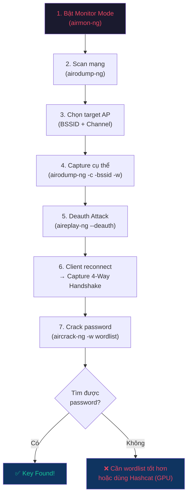

# 📚 Tổng hợp Kiến thức & Khái niệm từ Báo cáo InfoSec

> [!NOTE]
> Báo cáo: "Exploring and Deploying Aircrack-ng and Wifite in Kali Linux"
> Môn: Information System Security — VKU, Da Nang, May 2026

---

## 1. Danh sách Kiến thức & Khái niệm Cần Nắm

### 🔐 A. Chuẩn mã hóa Wi-Fi (Wireless Encryption Standards)

| Chuẩn | Năm | Mã hóa | Mức độ an toàn | Cần biết |
|-------|-----|--------|----------------|----------|
| **WEP** | 1997 | RC4 (stream cipher), IV 24-bit | Rất yếu — dễ crack | IV reuse, static key → Aircrack-ng crack trong vài phút |
| **WPA** | 2003 | RC4 + TKIP | Trung bình | TKIP thay đổi key mỗi packet, nhưng vẫn dùng RC4 |
| **WPA2** | 2004 | **AES + CCMP** | Mạnh | Chuẩn phổ biến nhất hiện tại. Lỗ hổng KRACK (2017) |
| **WPA3** | 2018 | AES + GCMP, **SAE** | Rất mạnh | Forward secrecy, chống brute-force offline |

**Mở rộng cần nắm:**
- **RC4**: Stream cipher — mã hóa từng byte, nhanh nhưng yếu vì IV ngắn (24-bit → ~16 triệu khả năng → dễ trùng lặp)
- **AES (Advanced Encryption Standard)**: Block cipher 128/192/256-bit, chuẩn vàng hiện tại
- **TKIP vs CCMP**: TKIP là bản vá tạm cho RC4; CCMP dùng AES, mạnh hơn hẳn
- **SAE (Simultaneous Authentication of Equals)**: Thay thế PSK handshake, chống offline dictionary attack
- **Forward Secrecy**: Dù lộ key hiện tại, dữ liệu quá khứ vẫn an toàn
- **KRACK Attack**: Khai thác lỗi reinstallation key trong 4-way handshake WPA2

---

### 🤝 B. 4-Way Handshake (WPA/WPA2)

Quy trình xác thực 4 bước giữa client và AP:

```
Client                         Access Point
  |---- 1. ANonce ------------->|
  |<--- 2. SNonce + MIC --------|
  |---- 3. Install Key + MIC -->|
  |<--- 4. ACK -----------------|
```

**Cần nắm:**
- **ANonce / SNonce**: Số ngẫu nhiên (nonce) để tạo PTK (Pairwise Transient Key)
- **MIC (Message Integrity Code)**: Đảm bảo message không bị sửa đổi
- **PTK**: Key phiên dùng để mã hóa traffic giữa client & AP
- **PMK (Pairwise Master Key)**: Được tạo từ PSK + SSID → dùng để sinh PTK
- Capture handshake = có đủ thông tin để thử brute-force PSK offline

---

### 📡 C. Các loại tấn công Wireless

| Tấn công | Mô tả | Công cụ |
|----------|-------|---------|
| **Deauthentication** | Gửi fake deauth frame → đá client ra → bắt handshake khi reconnect | aireplay-ng, mdk4 |
| **Handshake Capture** | Bắt 4-way handshake để crack offline | airodump-ng, Wifite |
| **Brute-force / Dictionary** | Thử từng password từ wordlist | aircrack-ng, hashcat, John the Ripper |
| **Evil Twin / Rogue AP** | Tạo AP giả cùng SSID → MitM | hostapd, Fluxion |
| **Packet Sniffing** | Bắt traffic trên mạng mở/yếu | Wireshark, tcpdump |
| **WPS Attack** | Brute-force WPS PIN (8 chữ số, ~11000 khả năng) | Reaver, Bully |
| **MAC Spoofing** | Giả MAC để bypass MAC filtering | macchanger |

**Mở rộng:**
- **802.11 Management Frames**: Không mã hóa trong WPA2 → deauth attack khai thác điều này. WPA3 có **Protected Management Frames (PMF)** để khắc phục
- **PMKID Attack**: Không cần deauth, chỉ cần 1 frame từ AP → nhanh hơn handshake capture (phát hiện 2018)

---

### 🛠️ D. Bộ công cụ Aircrack-ng

| Tool | Chức năng |
|------|-----------|
| **airmon-ng** | Bật/tắt monitor mode trên wireless interface |
| **airodump-ng** | Scan mạng, hiển thị AP + client, capture handshake |
| **aireplay-ng** | Inject packet, deauth attack |
| **aircrack-ng** | Crack WPA/WPA2 key từ .cap file + wordlist |

**Mở rộng:**
- **airbase-ng**: Tạo fake AP (Evil Twin)
- **airdecap-ng**: Giải mã traffic đã capture khi có key
- **packetforge-ng**: Tạo encrypted packet cho injection
- **airtun-ng**: Tạo virtual tunnel interface

---

### 🤖 E. Wifite

- Automated tool chạy trên nền Aircrack-ng, Reaver, Bully
- Tự động: scan → chọn target → deauth → capture handshake → crack
- Lưu handshake (.cap) và kết quả (cracked.json)

---

### 🖥️ F. Môi trường & Hạ tầng

| Khái niệm | Mô tả |
|------------|-------|
| **Kali Linux** | Distro Linux chuyên pentest, cài sẵn 600+ tool bảo mật |
| **Monitor Mode** | Chế độ NIC bắt mọi packet trong không khí (không chỉ packet gửi cho mình) |
| **Packet Injection** | Khả năng gửi packet tùy ý vào mạng wireless |
| **VirtualBox** | Ảo hóa; cần passthrough USB Wi-Fi adapter |
| **USB Wi-Fi Adapter** | Phải hỗ trợ monitor mode + injection (chipset Atheros, Ralink, Realtek RTL8812AU...) |

---

### 🛡️ G. Phòng thủ & Khuyến nghị

- Dùng **WPA3** hoặc WPA2-AES (không dùng WEP/WPA)
- Mật khẩu **>12 ký tự**, phức tạp, không dùng từ phổ biến
- **Tắt WPS**
- **MAC filtering** (thêm một lớp, không phải giải pháp chính)
- **Network segmentation** (tách guest / internal)
- **IDS/IPS**: Suricata, Snort
- **Cập nhật firmware** router thường xuyên
- **Pentesting định kỳ**

---

## 2. Tại sao dùng "A" mà không dùng "B, C, D"?

### 🔹 Tại sao dùng **Kali Linux** mà không dùng Ubuntu/Windows/Parrot OS?

| So sánh | Kali Linux ✅ | Ubuntu ❌ | Windows ❌ | Parrot OS 🔄 |
|---------|-------------|----------|-----------|-------------|
| Tool pentest cài sẵn | 600+ tool | Phải cài thủ công | Hầu hết không hỗ trợ | Có, nhưng ít phổ biến hơn |
| Monitor mode | Hỗ trợ native | Phải config nhiều | Không hỗ trợ tốt | Hỗ trợ tốt |
| Packet injection | Có sẵn driver | Cần cài thêm | Rất hạn chế | Có |
| Tài liệu/cộng đồng | Rất lớn (chuẩn ngành) | Ít cho pentest | Không phù hợp | Nhỏ hơn Kali |
| Dùng trong giáo dục | Chuẩn trong các khóa CEH, OSCP | Không phổ biến | Không | Ít |

> **Kết luận**: Kali Linux là lựa chọn chuẩn ngành vì cài sẵn mọi thứ, driver tương thích, cộng đồng lớn, và được dùng trong các chứng chỉ bảo mật quốc tế.

---

### 🔹 Tại sao dùng **Aircrack-ng** mà không dùng Hashcat/Kismet/Fern WiFi Cracker?

| So sánh | Aircrack-ng ✅ | Hashcat | Kismet | Fern WiFi Cracker |
|---------|-------------|---------|--------|-------------------|
| Chức năng chính | **Toàn bộ pipeline**: monitor → scan → deauth → capture → crack | Chỉ crack (nhưng nhanh hơn nhờ GPU) | Chỉ scan/detect, không crack | GUI-based, hạn chế |
| Hỗ trợ GPU | Không (CPU only) | **Có (CUDA/OpenCL)** | Không | Không |
| Monitor mode | Có (airmon-ng) | Không | Có | Phụ thuộc aircrack |
| Deauth attack | Có (aireplay-ng) | Không | Không | Có |
| Độ phổ biến | **Chuẩn ngành** | Phổ biến cho password cracking | Phổ biến cho wireless recon | Ít dùng |
| Học thuật | Nhiều tài liệu | Ít tài liệu cho wireless | Chuyên recon | Ít |

> **Kết luận**: Aircrack-ng là bộ công cụ **đầy đủ nhất** cho wireless pentest (từ scan đến crack). Hashcat mạnh hơn ở khâu crack nhưng không có khả năng capture/deauth. Trong báo cáo học thuật, Aircrack-ng cho phép demo **toàn bộ quy trình** tấn công.

---

### 🔹 Tại sao dùng **Wifite** mà không dùng Fluxion/WiFiPhisher/Bettercap?

| So sánh | Wifite ✅ | Fluxion | WiFiPhisher | Bettercap |
|---------|---------|---------|-------------|-----------|
| Mục đích | Auto pentest WPA/WPA2 | Evil Twin + social engineering | Phishing Wi-Fi | MitM framework |
| Cách tiếp cận | **Technical** (brute-force) | Social engineering | Social engineering | Network attack |
| Tự động hóa | Cao | Trung bình | Trung bình | Thấp |
| Dùng Aircrack-ng | **Có** (nền tảng) | Có | Không | Không |
| Phù hợp học thuật | **Rất phù hợp** | Phức tạp, ethical issues | Social engineering focus | Quá rộng |
| Dễ demo | **Có** | Cần nhiều setup | Cần nhiều setup | Cần kinh nghiệm |

> **Kết luận**: Wifite bổ sung hoàn hảo cho Aircrack-ng vì nó **tự động hóa** đúng những gì Aircrack-ng làm thủ công. So sánh 2 tool này cho thấy rõ trade-off **manual vs automated**, rất phù hợp cho mục đích học thuật. Các tool khác (Fluxion, WiFiPhisher) tập trung vào social engineering — khác hướng nghiên cứu.

---

### 🔹 Tại sao dùng **WPA2-PSK** làm mục tiêu test mà không dùng WEP/WPA3?

| | WEP ❌ | WPA2-PSK ✅ | WPA3 ❌ |
|--|-------|------------|--------|
| Phổ biến | Gần như không còn | **Phổ biến nhất** hiện tại | Đang tăng dần |
| Độ khó crack | Quá dễ (vài phút) | Vừa phải (phụ thuộc password) | Rất khó (SAE chống offline attack) |
| Giá trị học thuật | Quá đơn giản | **Lý tưởng** — đủ phức tạp để học | Quá mới, ít tool hỗ trợ |
| Thực tế | Không còn ai dùng | **80%+ mạng hiện tại** | Cần hardware mới |

> **Kết luận**: WPA2-PSK là mục tiêu thực tế nhất vì đại diện cho phần lớn mạng Wi-Fi hiện tại, đủ phức tạp để demo kỹ thuật tấn công, và có công cụ hỗ trợ đầy đủ.

---

### 🔹 Tại sao dùng **Dictionary Attack** (wordlist) mà không dùng pure brute-force hoặc rainbow table?

| | Dictionary Attack ✅ | Pure Brute-force ❌ | Rainbow Table ❌ |
|--|---------------------|---------------------|-----------------|
| Tốc độ | Nhanh (chỉ thử từ trong list) | **Cực chậm** (thử mọi tổ hợp) | Nhanh (lookup) |
| Hiệu quả | Cao nếu password phổ biến | Đảm bảo tìm được, nhưng có thể mất **năm** | Không áp dụng cho WPA2 |
| Lý do không dùng | — | 8 ký tự lowercase = 208 tỷ tổ hợp | WPA2 dùng SSID làm salt → mỗi mạng cần table riêng → không khả thi |
| Phù hợp demo | **Có** (nhanh, rõ ràng) | Quá lâu | Không khả thi |

> **Kết luận**: Dictionary attack (dùng wordlist như `rockyou.txt`) là phương pháp thực tế nhất. WPA2 dùng SSID làm salt nên rainbow table không hiệu quả. Pure brute-force quá chậm cho demo.

---

## 3. Sơ đồ Tổng quan Quy trình Tấn công



---

## 4. Checklist Kiến thức để Chuẩn bị Bảo vệ Báo cáo

- [ ] Giải thích sự khác nhau giữa WEP → WPA → WPA2 → WPA3
- [ ] Mô tả 4-Way Handshake và tại sao capture nó quan trọng
- [ ] Giải thích Monitor Mode vs Managed Mode
- [ ] Liệt kê workflow Aircrack-ng (airmon → airodump → aireplay → aircrack)
- [ ] So sánh Aircrack-ng (manual) vs Wifite (automated)
- [ ] Giải thích Deauthentication Attack hoạt động thế nào
- [ ] Tại sao dùng dictionary attack thay vì brute-force / rainbow table
- [ ] Các biện pháp phòng thủ (WPA3, strong password, disable WPS, IDS...)
- [ ] Ethical hacking: tại sao phải có consent, legal implications
- [ ] Tại sao cần USB Wi-Fi adapter riêng (chipset hỗ trợ monitor mode)
